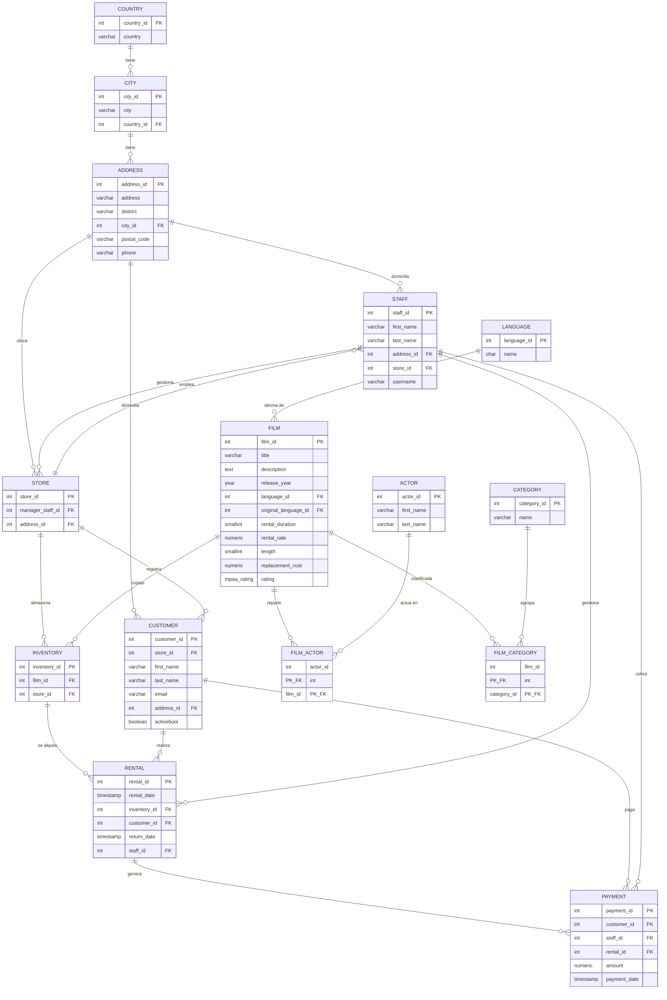

# Esquema de la base de datos

Base de datos **Sakila / Pagila**: gestión de un videoclub con dos tiendas. 15 tablas y 22 relaciones.

## Volumen de datos

| Tabla | Filas | Tabla | Filas |
|---|---:|---|---:|
| payment | 16.049 | film | 1.000 |
| rental | 16.044 | address | 603 |
| film_actor | 5.462 | city | 600 |
| inventory | 4.581 | customer | 599 |
| film_category | 1.000 | actor | 200 |
| country | 109 | category | 16 |
| language | 6 | staff | 2 |
| store | 2 | | |

## Cómo leer el modelo

El núcleo del negocio son tres bloques conectados entre sí:

- **Catálogo** — `film` es la ficha de cada película. Se relaciona con `actor` y con `category` a través de las tablas intermedias `film_actor` y `film_category`, porque ambas son relaciones de muchos a muchos: una película tiene varios actores y un actor sale en varias películas.
- **Existencias** — `inventory` representa cada copia física de una película en una tienda concreta. Una misma película puede tener varias copias repartidas entre las dos tiendas, y es esta tabla la que hace de puente entre el catálogo y los alquileres.
- **Operación** — `rental` registra cada alquiler (qué copia, qué cliente, qué empleado, cuándo se llevó y cuándo se devolvió) y `payment` el cobro asociado. La geografía cuelga de `address` → `city` → `country`, y de ahí salen tanto clientes como empleados y tiendas.

La consecuencia práctica es que **para ir de una película a sus alquileres siempre hay que pasar por `inventory`**: no existe relación directa entre `film` y `rental`.
